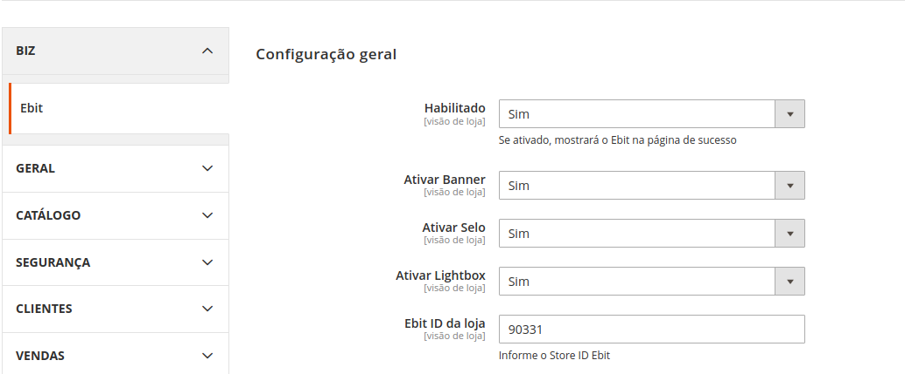
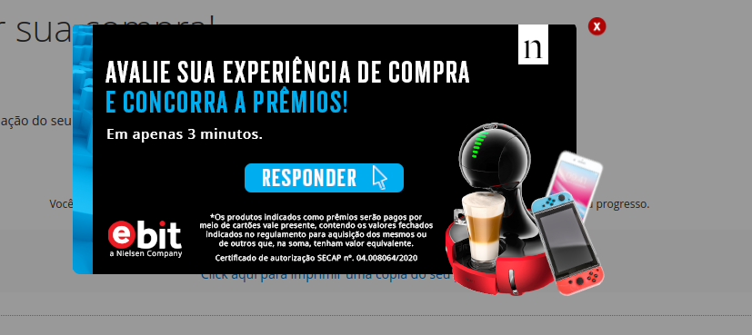

**Magento 2 Ebit** 

 # Lailson-Ebit

O `Lailson Ebit` foi criado para adicionar novas funcionalidades a qualquer coisa relacionada a cadastro de modulos no admin e emails dos  clientes no Magento.


## Instalação via .zip

Para instalar via arquivos devemos realizar o download do modulo, baixando diretamente do [repo](https://github.com/45lailson/module-ebit.git). Iremos realizar o wget para fazer o download.

Utilizando o 'wget' como exemplo abaixo:
```bash
$ wget https://github.com/45lailson/module-ebit/archive/master.zip
```
Descompacte os arquivos na **raiz** do seu Magento dentro da pasta **app/code** do seu projeto Magento.


# Instalação via Composer

Para instalar via composer devemos editar o composer.json do seu projeto Magento.

Edite o arquivo `composer.json` na raiz do Magento e busque pelo bloco `repositories`

Originalmente ela é assim:

```json
    ...
    "repositories": [
        {
            "type": "composer",
            "url": "https://repo.magento.com/"
        }
    ],
    ...
```
    

Adicione a linha abaixo:
```json
{
	"type": "vcs",
	"url": "https://github.com/45lailson/module-ebit.git"
}
```

Resultado final para o bloco `repositories` vai ficar assim:

```json
    ...
    "repositories": [
        {
            "type": "composer",
            "url": "https://repo.magento.com/"
        },
        {
	     "type": "vcs",
	     "url": "https://github.com/45lailson/module-ebit.git"
	}
    ],
    ...
```
Procure o bloco `require`, informa ao composer para instalar seu pacote. Exemplo:

```json
    ...
    
    "require": {
        "45lailson/module-ebit" : "dev-master ",
        "magento/product-community-edition": "2.3.5-p1"
    },

    ...
```

Para concluir a instalação execute o comando abaixo que o seu pacote seja instalado no Magento.
```bash
$ composer update
```

**Configurações** 

+ Modulo se encontra em `Lojas > Configurações > Biz > Ebit`



* [x] Ativar Banner Habilitara Um Banner ao Finalizar o Pedido no Checkout.


* [x] Ativar Lightbox Habilitara uma Janela ao Finalizar o Pedido, onde o cliente avaliara a experiencia de compra.




* [x] Store id Ebit E Necessario para inserir a loja que sera avalidado pelo cliente junto a ebit.

* [x] ```Observação E Necessario um Store ID Valido para que seja possivel realizar o Fluxo corretamente```.


